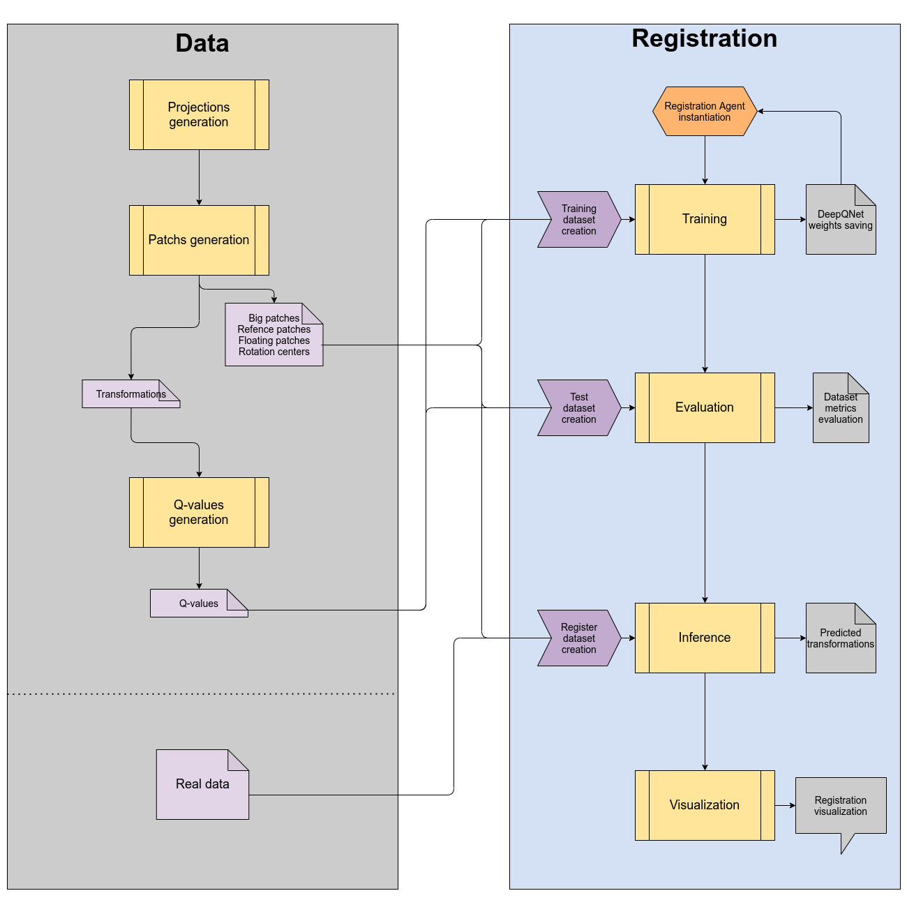

# Registration 2D / 2D with a Deep Q Learning approach - An implementation

## Context

This project is an end of studies joint project between 
[École Pour l’Informatique et les Techniques Avancées (*EPITA*)](https://www.epita.fr/)
[IMAGE specialization](https://www.epita.fr/nos-formations/diplome-ingenieur/cycle-ingenieur/les-majeures/#majeure-IMAGE)
and [GE Healthcare](https://www.gehealthcare.fr/).

###### EPITA students
Geoffrey Jount <geoffrey.jount@epita.fr>\
Nicolas Portal <nicolas.portal@epita.fr>\
Raphaël Dias--Monteiro <raphael.dias-monteiro@epita.fr>

###### GE Healthcare supervisors
Maxime Taron <maxime.taron@ge.com>\
Thomas Benseghir <thomas.benseghir@ge.com>

## Previous works 

This project is based on [Liao et al., *An Artificial Agent for Robust Image Registration*, 2016, arXiv:**1611.10336**](https://arxiv.org/abs/1611.10336).

## Documentation

The provided documentation is not aimed at presenting the problem, describing the reasoning behind the developed
framework or providing results and comparisons over other possible solutions.

## Architecture

### `agent` module

###### Files
- `registration.py` 

The `agent` module contains the `RegistrationAgent` object that features the principal methods to:
- fit training data,
- evaluate registration with ground truth data
- infer registration transformations
- visualize the agent registration steps

### `datasets` module

###### Files
- `dataset.py`

The `datasets` module contains the several dataset interfaces that are used in this project.\
The base class `DQNDataset` inherits from `Pytorch Dataset` object and acts as an abstract class that should not be used
by itself. This dataset owns reference images and floating images.\
From this class derive three useful classes:
- `TrainDQNDataset` - owns the q-values used in training
- `RegisterDQNDataset` - owns the big images and the centers of rotations
- `TestDQNDataset` - derives from `RegisterDQNDataset`, owns the ground truth transformations  

### `deepqnet` module

###### Files
- `deepqnet.py`

The `deepqnet` module contains the Convolutional Neural Network model that is used to learn a reward policy for the
registration agent.

This model is built on top of `Pytorch` neural network modules and layers. The `fit` method requires a generator built
from a `TrainDQNDataset`. 

### `qvalues` module

###### Files
- `qtable.py`
- `qvalues.ipynb`

The `qvalues` module contains the actions of the agent following the three degrees of freedom, the `Q` object that
computes the reward for a given transformation and the `Q_table` object that stores an array of `Q` objects.

The q values once computed are saved to a folder to be used when fitting the DeepQNet model.

The `qvalues.ipynb` notebook is the interface to specify the data to be loaded and from which to compute the q values
accordingly. 

### Root

###### Files
- `utils.py`

- `evaluation.ipynb`
- `training.ipynb`
- `visualization.ipynb`

The `utils.py` file exposes several functions that are used to manipulate the images when applying transformations or
to visualize registration steps.

The different notebooks do exactly what their names are.

## Pipeline

## Setting up and running

TODO
